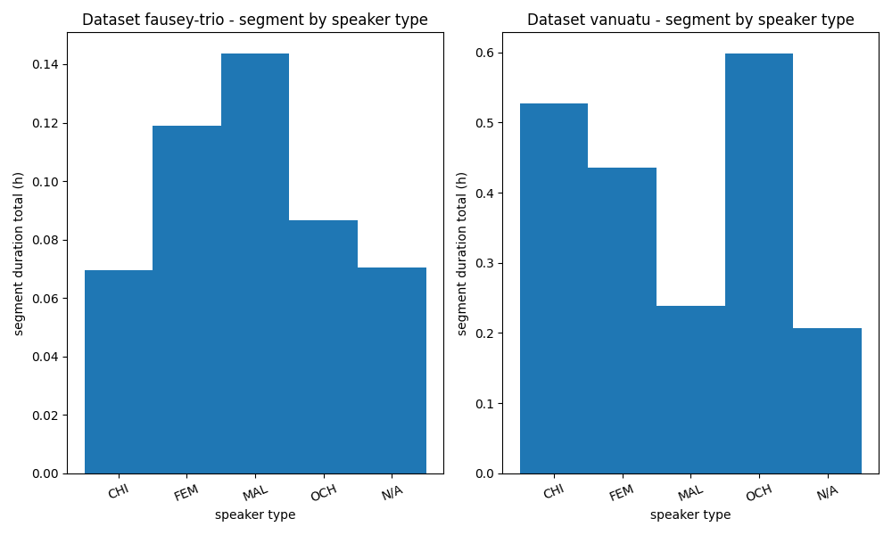

# Benchmarking Dataset Factory 2025

This benchmarking dataset factory contains scripts to create datasets for use in benchmarking supervised ML models.

This dataset contains human "gold-standard" annotation data available to LAAC around the time of writing (Dec 2, 2025). Our main focus has been on getting (1) addressee, (2) vocal maturity, (3) transcription data and (4) vocalization type data in one place.

The 4 categories of gold standard annotation data are roughly defined as:
1. Addressee data which identifies who is being addressed during a session, typically at the level of target/other child, adult, pet etc.
2. Vocalization/speech maturity data, which tells you the vocalization maturity of the young child speaker e.g., canonical, non-canonical vocalizations, syllable types, laughing, crying etc.
3. Transcription data which shows what is said in the language of origin, sometimes with available translations
4. Vocalization type, in the case of these corpora almost always the categories key child, other child, adult male, adult female in the `speaker_type` column

As well as containing human annotation data, this repository contains scripts that allows you to find certain annotation data, satisfying certain conditions.

## General Workflow
The benchmarking dataset has been designed implicitly as a tiny data pipeline. It works as follows:
1. Add datasets you want to use
2. Generate human annotation metadata for your datasets
3. Hand-write human annotated metadata index based on the output of (2)
4. Validate your metadata written in (3)
5. Once valid, generate your dataset

### Adding Datasets
Datasets added in the /datasets folder must satisfy the ChildProject dataset structure in order to be correctly parsed by the generation scripts.

Our workflow includes datalad for version control and handling remote file storage/retrieval. Therefore, to add a dataset, `cd` into the /datasets folder and run

```bash
datalad clone -d .. [remote storage URL]
```

For example `datalad clone -d .. git@gin.g-node.org:/my_organization/my_dataset.git` if your storage solution is GIN, although DataLad supports many clouds out of the box. Note that cloning always requires SSH certification and user access.

Remember also to fetch the non-large files data, e.g.,
```bash
datalad get --no-data [repository name]
```

If your annotation data is classified as "large" and not immediately fetched, use
```bash
datalad get [glob pattern] -J [num of concurrent connections]
```
e.g., `datalad get my_dataset/annotations/eaf_2016/converted/** -J 10`

Note that, not only does your dataset need to follow the ChildProject structure, but every human annotation ChildProject "set" needs to have an associated `metannots.yml` file, as per the ChildProject documentation. These meta annotations are used in the next step.

Optionally, to validate your dataset's meta annotations use
```bash
uv run -m scripts.validate_metannots.py --dataset-name [dataset name]
```

### Generate Human Annotation Data Metadata
Once you have added your datasets and fetched your annotation data, you can generate human annotation metadata using the `get_human_annotation_metadata` script. This creates json-formatted metadata over the human annotation data for your dataset, e.g.,

```bash
uv run -m scripts.get_human_annotation_metadata --dataset-name "my_dataset"
```

Running the above script generates `outputs/human_annotation_data/human_annotation_data-my_dataset.json` outlining the amount of annotations available. Here is an example for `png2016`:
```json
{
  "name": "png2016",
  "sets": [
    {
      "name": "eaf_2016",
      "columns": [
        {
          "column": "mwu_type",
          "categorical": true,
          "values": [
            "nan",
            "<NA>",
            "1",
            "M",
            "1"
          ],
          "annotated_duration_ms": 1337411,
          "duration_from_samples_ms": 22454000,
          "number_of_samples": 206,
          "num_of_non_empty_segments": 1519
        },
...
```
This metadata is useful as (1) a filter, (2) a summary and (3) a view to inspect what kind of data is available.

### Hand-write an Index for your Data
Here we need a human in the loop. We need to write an index to aid in the discovery of data related to the four categories of human annotated data. The correct identification of ChildProject sets–sets are collections of related data in ChildProject–containing such data can only be achieved through human judgement.

Inspecting the output from the previous step, it can be readily seen which data is available. Using this output as a source of truth, and potentially inspecting the human annotations themselves, an index is written at outputs/manually_annotated_metadata.json. This shows only the top of the file:

```json
{
    "datasets":
    [
        {
            "name": "bergelson",
            "sets": [
                {
                    "name": "eaf/an1",
                    "addressee_cols": ["addressee"],
                    "vcm_cols": ["vcm_type"],
                    "vtc_cols": ["speaker_type"],
                    "transcription_cols": ["transcription"],
                    "other": ["words", "lex_type", "mwu_type", "speaker_id"]
                },
                {
                    "name": "eaf_high_volubility",
                    "addressee_cols": ["addressee"],
                    "vcm_cols": ["vcm_type"],
                    "vtc_cols": ["speaker_type"],
                    "transcription_cols": ["transcription"],
                    "other": ["words", "lex_type", "mwu_type", "speaker_id"]
                },
                {
                    "name": "eaf/reliability",
                    "addressee_cols": ["addressee"],
                    "vcm_cols": ["vcm_type"],
                    "vtc_cols": ["speaker_type"],
                    "transcription_cols": ["transcription"],
                    "other": ["lex_type", "mwu_type", "speaker_id"]
                }
            ]
        },
...
```

### Validate your Manual Index
Because the index is hand-written, it needs to be validated and rewritten until it passes all checks. Validate your manual metadata with
```bash
uv run -m scripts.validate_manual_metadata.py
```
This script compares, for instance, your manual metadata with the human annotation data json files to see that column names aren't mispelled, or that columns aren't missing.

### Generate a Benchmarking Dataset
The meat of this repository is in the dataset generation script. It can be run like

```bash
uv run -m scripts.create_dataset --output-path [location of generated dataset] \
  --fetch-files // Fetch large files with DataLad if not present  \
  --type vtc  \
  -d my_dataset \
  -d my_other_dataset
```
To generate a vocalization type dataset.
There are many more options available, and its usage is complex. It can be used to generate the dataset in one fell swoop, or to generate one step at a time, or one dataset at a time, or both one step and one dataset a time. This is very useful if you need short feedback loops for testing/exploring/validating your generated dataset.

Below is an example of adding a subdataset to a generated benchmarking dataset using the `--additive` flag, rather than generating it from scratch
```bash
uv run -m scripts.create_dataset --output-path [location of generated dataset] \
  --fetch-files // Fetch large files with DataLad if not present  \
  --type vtc  \
  -d my_added_subdataset \
  --additive
```

## Dependency management
I decided to use `uv`. Things will probably work fine with the `ChildProject` conda environment we have been using for so long internally, maybe installing one or two missing dependencies.

But if you want to use `uv` instead, simply use `uv run`, e.g.,

```bash
uv run -m scripts.get_human_annotation_metadata --dataset-name vanuatu
```

The use of `uv` is encouraged over `conda` as it allows locking of dependencies, and therefore correct reproducibility, at least as far as Python packages are concerned.

## Linting, Formatting and More
I use `tox` to keep code clean and standard. `pipx install tox`, and run `tox` to run some automated checks on the scripts folder.

## Scripts
### find_files_on_filter_expression.py
```
Usage: find_files_on_filter_expression.py [OPTIONS]

  Save file paths matching filter expressions on metannots and
  children metadata (specified separately)

Options:
  -d, --dataset TEXT            datasets to graph. If not specified,
                                will use all datasets

  --metannots-filter-expr TEXT  Filter expression on metannots like
                                'has_addressee == 'Y'' (see Pandas +
                                ChildProject docs)

  --children-filter-expr TEXT   Filter expression on children metadata
                                like 'child_sex == 'f'' (see Pandas +
                                ChildProject docs)

  --output-csv PATH             Output .csv path  [required]
  --help                        Show this message and exit.
```
This script lets you find files matching certain conditions. See the Pandas documentation for filter expressions. See the ChildProject documentation to see what columns can be looked for.

Note that ChildProject does not parse dates or anything like that, so all columns, like `child_dob` for example, are interpreted as strings. Luckily this turns out to be okay for comparisons of the sort below.

```bash
uv run -m scripts.find_files_on_filter_expression --metannots-filter-expr "has_addressee == 'Y'" --children-filter-expr "child_dob < '2006-06-06'"
```

Note that if values are missing in the metadata–which is very often the case except on required columns–the filter expression will typically jump over them (these values are `<NA>`) and ignored.

The output is a .csv file with the human annotation file path, recording file path, annotation start, end, duration and recording duration. Typically, you'll want to do some weighted train, test, validation split based on these durations, which is standard stuff in any ML toolkit. Note that the human annotation file typically signifies only a given part of the recording file that was listened to by an annotator, hence the choice of columns.

### find_on_filter_expression.py
```
Usage: find_on_filter_expression.py [OPTIONS]

  Find datasets and sets matching a filter expression on the metannots
  metadata

Options:
  --filter-expr TEXT  Filter expression like 'has_addressee == 'Y'' (see
                      Pandas + ChildProject docs)
  --no-info-output    Don't print info, such as error info. Only print
                      datasets and sets
  --help              Show this message and exit.
```

Pandas has a feature called "filter expressions", which are just the kinds of expressions you pass into dataframes to filter them down, e.g., `annotations[annotations["has_vcm_type"] == "Y"]`, or equivalently, `annotations.query('has_vcm_type == "Y"')`.

This script lets you pass in a filter expression and prints out the dataset and set (as it's called in ChildProject) that matches them.

Example:
```bash
uv run -m scripts.find_on_filter_expression --filter-expr "has_vcm_type == 'Y'" --no-info-output
```

Output (stdout):
```bash
Dataset: 'vanuatu'       Set: 'eaf_2023/AD'
Dataset: 'vanuatu'       Set: 'eaf_2023/AM'
Dataset: 'vanuatu'       Set: 'eaf_2023/HM'
Dataset: 'vanuatu'       Set: 'eaf_2023/MC'
Dataset: 'vanuatu'       Set: 'eaf_2023/MR'
```

### validate_metannots.py
```
Usage: validate_metannots.py [OPTIONS]

  Validate metannots. Prints out validation errors across datasets and
  sets

Options:
  --help  Show this message and exit.
```

This script uses the schema laid out in the ChildProject documentation for metannots and checks that there are no errors. It prints any validation errors to standard output. Under the hood uses pydantic.

Can be run simply with

Prints out validation errors. Usage:

```bash
uv run -m scripts.validate_metannots
```

Or more practically, with output redirection:

```bash
uv run -m scripts.validate_metannots > validation_errors.txt
```

### get_human_annotation_metadata.py
```
Usage: get_human_annotation_metadata.py [OPTIONS]

  Aggregates human annotation metadata for a given dataset (mostly
  duration-related) and saves it

Options:
  --dataset-name TEXT  Dataset name to process
  --help               Show this message and exit.
```

This script summarizes available human annotation metadata by going through the converted .csv files

It also tries to summarise what kinds of values are available in this data, by making a guess at whether the data is categorical in nature or not.

It gathers the total length of annotated segments, as well as the total length of the associated sampled recordings.

Since models, for training, testing and validation, have to compare against annotated segments, the former statistic is probably more useful. But the other is also useful, which is that you may want to train on the absence of annotated segments as well instead of cherry-picking on slices of audio that have an explicit speech label laid down by a human. That is to say, in a training batch of say 12 seconds of annotated audio, there are unannotated pauses between the labelled speech segments, which the model should learn not to try to label as any sort of speech. For this the true available data–meaning whatever audio the annotator had at their disposal, including audio he/she didn't label–can often be calculated separately, not using this script, but using the `metannots.yml` file, based on the `sampling_count` and `sampling_unit_duration`.

Example:
```bash
uv run -m scripts.get_human_annotation_metadata --dataset-name "vanuatu"
```

Output (to `outputs/human_annotation_data/human_annotation_data-vanuatu.json` file):
```json
{
  "name": "vanuatu",
  "sets": [
    {
      "name": "eaf_2023/AD",
      "columns": [
        {
          "column": "speaker_type",
          "categorical": true,
          "values": [
            "CHI",
            "OCH",
            "FEM",
            "MAL"
          ],
          "annotated_duration_ms": 760555,
          "duration_from_samples_ms": 864000
        },
        ...
      ]
    },
    {
      "name": "eaf_2023/HM",
      "columns": [
        {
          "column": "speaker_type",
          "categorical": true,
          "values": [
            "OCH",
            "MAL",
            "FEM",
            "CHI"
          ],
          "annotated_duration_ms": 908559,
          "duration_from_samples_ms": 864000
        },
        ...
      ]
    },
    ...
  ]
}
```

### graph_dataset_distribution.py
```
Usage: graph_dataset_distribution.py [OPTIONS]

  Lets you graph distributional info of metadata over a dataset

  If looking at segments, will choose information only from human-
  annotated sets If looking at recordings in general, will choose all
  recording information regardless of which sets

Options:
  -d, --dataset TEXT              datasets to graph. If not specified, will
                                  use all datasets
  -x, --x-axis [child_id|child_age|child_sex|speaker_type|speaker_id]
                                  x-axis  [required]
  -y, --y-axis [segment|recording]
                                  y-axis  [required]
  --metric [duration_mean|count|duration_std|duration_total]
                                  function to run over aggregated data
                                  [required]
  --sort-by-y                     Sort data by y (instead of x) axis
  --aggregate                     Aggregate over datasets to obtain a
                                  single plot
  --output-folder PATH            path of output folder
  --help                          Show this message and exit.
```

This is a generic graphing script that gives you a basic outline of how much data is available over some categorical index.

The following is some example output for the following command:
```bash
uv run -m scripts.graph_dataset_distribution -d vanuatu -d fausey-trio -x speaker_type -y segment --metric duration_total
```



### split_data.py
```
Usage: split_data.py [OPTIONS]

  Splits the output of `find_files_on_filter_expression.py` based on a
  specified train, test, validation split

Options:
  --input PATH       Input file (output from
                     `find_files_on_filter_expression.py`)  [required]

  --train FLOAT      Train percentage in [0, 1]  [required]
  --test FLOAT       Test percentage in [0, 1]  [required]
  --validate FLOAT   Validation percentage in [0, 1]  [required]
  --output-csv PATH  Output .csv path  [required]
  --same-child       Stratify by child
  --same-set         Stratify by set
  --seed INTEGER     Random seed for split
  --help             Show this message and exit.
```

This script takes the output from `find_files_on_filter_expression.py` and adds a column "split" to it.

To split data among train, test, validation sets, you can use this script. Unlike the standard routines in sklearn or TensorFlow this routine can actually take into account the length of the recordings themselves. It also stratifies according to the set and child id inside a dataset.

You can call it as follows:
```bash
python3 scripts/split_data.py --input /Users/me/Desktop/benchmarking-data-2025/files.csv --train 0.8 --test 0.1 --validate 0.1 --output-csv files_with_split.csv --same-child --same-set --seed 0
```

With output
```bash
Found split!
Desired train, test, validation split (ms): 1188633405, 148579175, 148579175
Found train, test, validation split (ms): 1187692678, 148317595, 149781484
```

By changing the seed you'll get slightly different splits, as it shuffles the file paths.